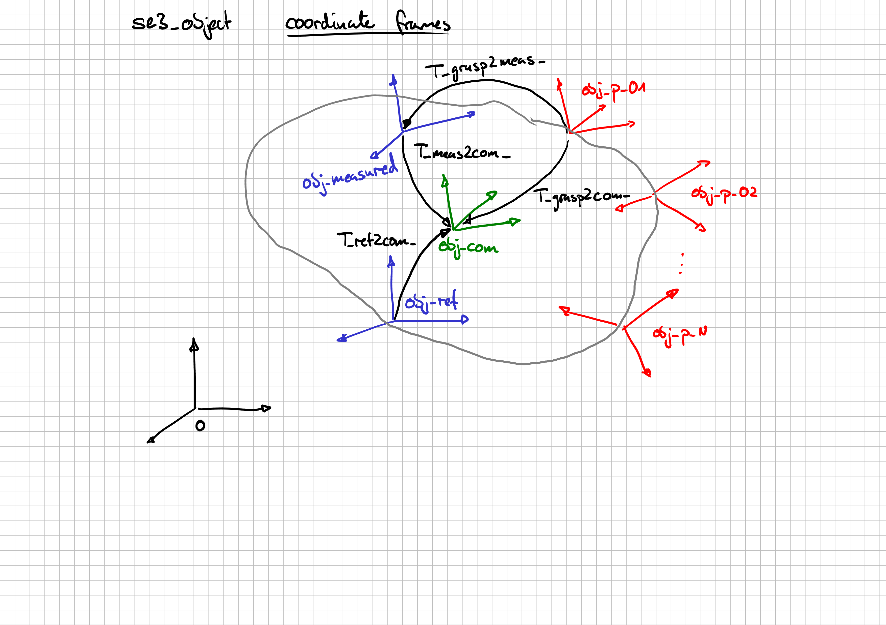

[BACK](../Readme.md)

## object coordinate frames 



```cpp
pinocchio::SE3 T_meas2com_;                // transformation from measurement to com frame
pinocchio::SE3 T_ref2com_;                 // transformation from ref to com frames
std::vector<pinocchio::SE3> T_grasp2meas_; // transformation from grasp to mocap frames
std::vector<pinocchio::SE3> T_grasp2com_;  // transformation from grasp to com frames
```